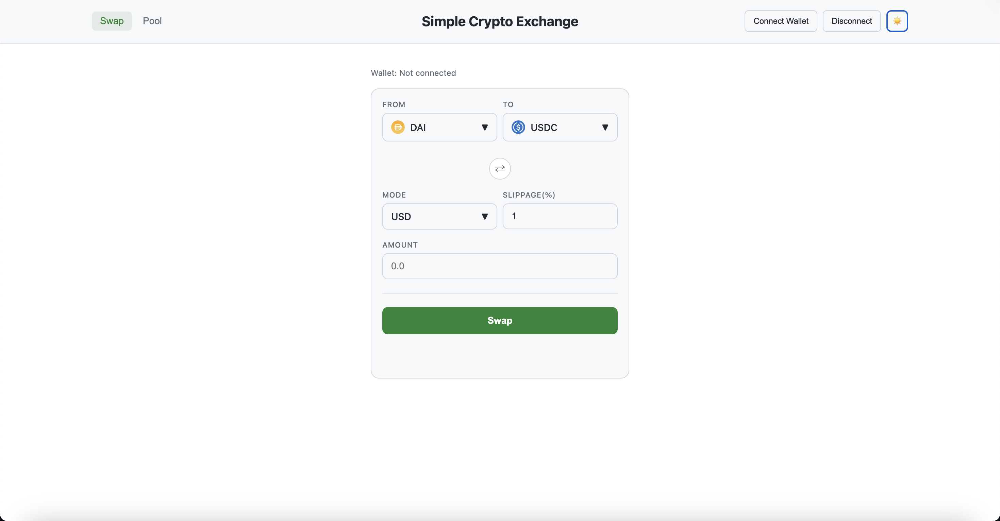

# Uniswap V2 Token Swap Interface

[](https://mydex-seven.vercel.app)
[](https://mydex-seven.vercel.app)
Video tutorial: [Watch on YouTube](https://youtu.be/DxhU5wpNu9o?si=2BjQ4SWRPwDWEMac)


---

<p align="center">
  <picture>
    <source media="(prefers-color-scheme: dark)" srcset="assets/darkmode.png">
    <source media="(prefers-color-scheme: light)" srcset="assets/lightmode.png">
    
  </picture>
</p>

---


A simple Uniswap V2-style token swap interface built with **HTML + JS + MetaMask + Ethers.js**.

- Frontend: `public/index.html`, `public/swap.js`
- Example contracts: `contract/factory.sol`, `contract/router.sol` (placeholders for your own UniswapV2-compatible contracts)

Deploy Your Own Contracts
-----------------------------------
If you want your own Factory/Router. The repo includes placeholders in `contract/` — you can replace them or point to your own.

---

### ⚙️ Setup / Usage

1. **Deploy contracts**
   - Deploy your Factory contract.  
   - Deploy your Router contract and link it to the Factory.

2. **Prepare tokens**
   - Add liquidity or approve token spending for the Router.

3. **Configure frontend**
   - Update `routerAddress` in `swap.js`.

4. **Run locally**
   ```bash
   cd public
   python3 -m http.server


Frontend Configuration
----------------------
Once deployed, update the frontend addresses:
- Open `public/swap.js`
- Set `routerAddress` to your deployed router
- Update `tokenAddresses` to the ERC-20 tokens on your network